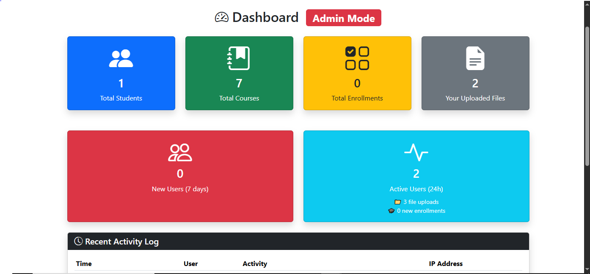

# Student Management System

A complete web application for managing students, courses, enrollments, and files with authentication and API support.



## Features

- 🛡️ User authentication (Login/Registration)
- 👥 Role-based access (Admin/User)
- 📚 Student, Course, and Enrollment management
- 📁 Secure file upload system
- 🔒 API endpoints with token authentication
- 📊 Admin dashboard with analytics
- 📱 Responsive Bootstrap 5 interface

## Technology Stack

- CodeIgniter 4 (PHP Framework)
- MySQL Database
- Bootstrap 5 (Frontend)
- jQuery (AJAX interactions)

## Installation Guide

### Prerequisites

1. PHP 7.4 or higher
2. MySQL 5.7+
3. Composer (for dependencies)
4. Web server (Apache/Nginx)

### Step 1: Clone the Repository

```bash
git clone https://github.com/ZeroPhantom0/student-management.git
cd student-management